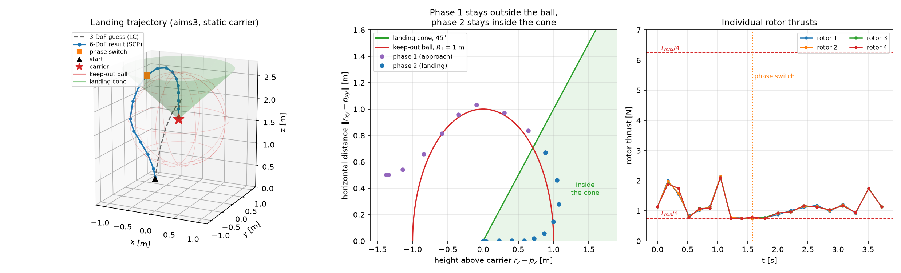
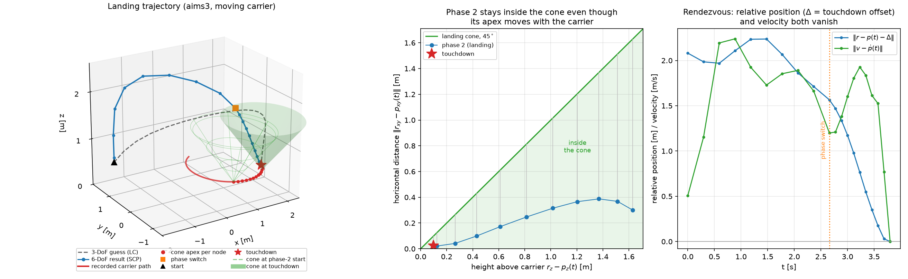

# scvx-landing-AVC

Reference implementation of the trajectory planner in

> Z. Shen, G. Zhou, H. Huang, C. Huang, Y. Wang and F.-Y. Wang,
> "**Convex Optimization-Based Trajectory Planning for Quadrotors Landing on Aerial Vehicle Carriers**,"
> *IEEE Transactions on Intelligent Vehicles*, vol. 9, no. 1, pp. 138–150, Jan. 2024.
> [doi:10.1109/TIV.2023.3327263](https://doi.org/10.1109/TIV.2023.3327263) · [IEEE Xplore](https://ieeexplore.ieee.org/document/10294286)

The planner computes safe, agile and accurate landing trajectories for a quadrotor approaching an
aerial vehicle carrier (AVC), both when the carrier is static and when it is moving.



*The scenario enabled by default in `scvx_test.py`. Left: the 3-DoF guess and the 6-DoF result.
Middle: the same trajectory in terms of the two safety constraints — the approach phase rides along
the keep-out ball, the landing phase stays inside the 45° cone. Right: the four rotor thrusts against
their bounds. Reproduce it with `python docs/make_example_figure.py`.*

## Method

The planning problem is solved in two stages.

1. **3-DoF stage (lossless convexification).** The nonconvex lower-thrust-bound and thrust-pointing
   constraints of the point-mass landing problem are losslessly convexified, so a single SOCP yields
   a dynamically consistent position/velocity/acceleration profile. This stage is cheap and is used
   only to produce an initial guess.
2. **6-DoF stage (sequential convex programming).** The 3-DoF solution is lifted to the full 13-state
   quadrotor model (position, velocity, attitude quaternion, body rates) with four individual rotor
   thrusts as the input. The nonlinear dynamics are linearised about the previous iterate,
   discretised with a first-order hold, and the resulting convex subproblem is solved repeatedly
   until the virtual-control cost `J_vc` and the trust-region cost `J_tr` drop below their tolerances.

Both stages split the flight into two temporal phases of `K_phase = ceil(K/2)` and `K - K_phase + 1`
nodes. The 3-DoF stage takes the two phase durations as fixed fractions of `tf_guess` (60 %/40 % in
`scvx_landing`, 70 %/30 % in the moving-carrier entry point); the 6-DoF stage treats them as free
variables `sigma_1` and `sigma_2`.

- **Phase 1 — approach.** A linearised ellipsoidal keep-out constraint around the carrier keeps the
  quadrotor outside a safety ball (default radius `R1 = 1 m`, centred on the landing target) while it
  flies towards the carrier. The phase must end inside a small ball above the target, which places the
  vehicle at the mouth of the landing cone.
- **Phase 2 — landing.** A second-order-cone *landing cone* constraint,
  `‖r_xy − p_xy‖ ≤ (r_z − p_z)·tan γ`, forces the descent to stay inside a cone anchored at the
  landing point (default half-angle 45°). For a moving carrier the cone apex `p` is time-varying and
  is interpolated from the recorded carrier trajectory at each node.

The state at the end of phase 2 is constrained to match the carrier position *and velocity*, which is
what makes landing on a moving AVC possible.

## Repository layout

```
scvx_test.py                            entry point: a collection of example scenarios
data/
  loop_traj_platform_new.csv            recorded AVC log used by the moving-carrier experiment
docs/
  make_example_figure.py                regenerates the static-carrier figure in this README
  make_moving_figure.py                 regenerates the moving-carrier figure in this README
scripts/
  twophase_landing_6dof_server.py       main planner: 3-DoF + 6-DoF pipelines (scvx_landing*)
  twophase_landing_6dof_server_numba.py experimental variant with threaded discretization
  landing_phase_planner.py              ROS node; replans the landing phase online
  utils.py                              obstacle/cone helpers, quaternion utils, plotting
  Configuration/
    parameters_3dof_landing_twophase.py node count, solver and weights for the LC stage
    parameters_6dof_landing_twophase.py node count, solver, weights and SCP tolerances
  Models/
    quadrotor_3dof_landing_twophase.py  point-mass model + losslessly convexified constraints
    quadrotor_6dof_x_landing_twophase.py            6-DoF model, static carrier
    quadrotor_6dof_x_landing_twophase_moving.py     6-DoF model, moving carrier
    quadrotor_6dof.py, IROS2019_3dof.py             earlier models kept for reference
  SCP/
    discretization_3dof_landing_twophase.py         first-order hold, 3-DoF
    discretization_noloop_x_landing_twophase.py     first-order hold, 6-DoF (vectorised)
    discretization_noloop_x_landing_twophase_compile.py  same, as free functions for JIT
    scproblem_3dof_landing_*.py                     CVXPY subproblems for the LC stage
    scproblem_quad_6dof_socp_landing_*.py           CVXPY subproblems for the SCP stage
```

## Installation

Python 3.8 or newer, with:

```bash
pip install -r requirements.txt
```

This installs everything needed to run the planner with an open-source solver. Both configuration
files pick the solver with
`solver = [cp.ECOS, cp.MOSEK, cp.GUROBI, cp.SCS][1]`, so the default is **MOSEK**, which needs a
license (free for academic use). Change the index to `3` for SCS, which is installed together with
CVXPY, or substitute any other CVXPY solver — the figure scripts in `docs/` fall back to
`cp.CLARABEL` when MOSEK is not available.
ECOS (index `0`) has no wheels for recent Python versions and needs a C compiler to build.

`scripts/landing_phase_planner.py` and the `_numba` server additionally import `rospy`/`actionlib`;
they are only needed if you want to run the planner as a ROS node and can be ignored otherwise.

## Quick start

Run from the repository root, so that the `scripts.` package imports resolve:

```bash
python scvx_test.py
```

`scvx_test.py` holds the scenarios used in the paper — the simulation cases, the indoor experiments
and the ablations. All but the last one are commented out; uncomment the line you want to reproduce.

To call the planner from your own code:

```python
import numpy as np
from scripts.twophase_landing_6dof_server import scvx_landing

X_traj, time_traj, U_traj = scvx_landing(
    "aims3",                       # quadrotor configuration
    np.array([0.0, 0.05, 1.677]),  # landing target position [m]
    3.0,                           # total flight time guess [s]
    np.array([-0.5, 0.0, 0.3]),    # quadrotor initial position [m]
    plot=True,
)
```

| Entry point | Purpose |
| --- | --- |
| `scvx_landing` | static carrier; LC 3-DoF guess followed by 6-DoF SCP |
| `scvx_landing_moving_exp` | moving carrier; time-varying landing cone from a recorded carrier trajectory |
| `scvx_landing_new` | static carrier, with the keep-out constraint also enforced in the 3-DoF stage |
| `scvx_landing_no_3dof`, `scvx_landing_moving_exp_no_3dof` | ablations: straight-line initialisation instead of the LC guess |

All of them accept `plot` (3-D matplotlib preview) and `replan` (also return the solver object so the
landing phase can be re-solved online); every one except `scvx_landing_new` also accepts `goal_v`,
the carrier velocity at touchdown.

Returned arrays: `X_traj` is `K × 13` (position, velocity, quaternion `[w, x, y, z]`, body rates),
`U_traj` is `K × 4` individual rotor thrusts in newtons, and `time_traj` holds the `K` node times.
The same data is written to `scvx_traj1.csv` (6-DoF) and `scvx_traj1_3dof.csv` (LC guess) in the
working directory; the ablation entry points write `scvx_traj1_6dof.csv` and `scvx_traj1_init.csv`.

### Moving carrier

The time-varying landing cone is built from the recorded AVC trajectory in
`data/loop_traj_platform_new.csv` — the motion-capture log of the platform flying a loop during the
indoor experiments, sampled at 120 Hz. Its location is set by `carrier_traj_file` in
`scripts/Configuration/parameters_6dof_landing_twophase.py`, and `SCProblem` also takes a `traj_file`
argument. The file is read with `pd.read_csv(..., header=None)` and only columns 1 to 4 are used, as
time, x, y and z; the remaining columns of the log are ignored.

```python
scvx_landing_moving_exp("aims3", np.array([1.706, -0.682, 0.597]), 3.8,
                        np.array([-1.5, 1.5, 0.5]),
                        goal_v=np.array([0.7102, 0.7084, 0.0]))
```



*The scenario above. Left: the carrier flies a loop (red) while the quadrotor descends, and the
landing cone travels with it — drawn at the start of phase 2 and again at touchdown, with the apex
used at every phase-2 node marked. Middle: the cone constraint evaluated against each node's own
apex; the descent stays inside with 7 cm of margin at the tightest node. Right: the quadrotor's
position relative to the carrier — less the touchdown offset `Δ` described below — and its velocity
relative to the carrier, both of which vanish at touchdown. Reproduce it with
`python docs/make_moving_figure.py`.*

Two constants in `scripts/SCP/scproblem_quad_6dof_socp_landing_twophase_moving_exp.py` are tied to
this specific call and have to be re-derived for another manoeuvre:

- `start_time = 3.025` is the offset at which the manoeuvre begins in the log.
- `time_points` are the phase-2 node times, and they assume `tf_guess = 3.8 s` split 70 %/30 %.

Together they fix the instant of touchdown at `t = 3.025 + 3.8 = 6.825 s` in the log, where the
platform is at `(1.706, -0.708, 0.5)` moving at `(0.710, 0.708, 0)`. That is where `goal` and
`goal_v` above come from; `goal` adds the 2.6 cm / 9.7 cm body offset that puts the landing gear on
the deck rather than the body centre. A different `start_time` or `tf_guess` means a different
touchdown state, so the two have to be updated together.

The phase-1 keep-out ball is inactive in this scenario — the approach never comes closer than 2.05 m
to the carrier, against `R1 = 1 m` — which is why the figure above omits it.

Note also that the terminal attitude constraint is commented out in this subproblem (only the
terminal body rate and the hover thrust are enforced), so the moving-carrier solution touches down
with a non-zero yaw.

## Configuration

Algorithm settings live in `scripts/Configuration/`: number of discretization nodes (`K`, `K_3dof`,
both 20), maximum SCP iterations, convergence tolerances `epsilon_vc` / `epsilon_tr`, and the
virtual-control and trust-region weights `weight_nu` / `weight_dx`.

Vehicle settings live in the model classes and are selected by the `quad_name` argument:

| `quad_name` | Mass | Notes |
| --- | --- | --- |
| `"aims1"` | 0.661 kg | experimental platform, X configuration |
| `"aims3"` | 0.463 kg | experimental platform used for the moving-carrier tests |
| `"iris"` | 1.52 kg | PX4 SITL model |
| anything else | 0.68 kg | built-in defaults |

Each entry sets mass, inertia, arm geometry, torque coefficient and thrust bounds. The landing cone
half-angle (`glidelslope_angle`), maximum body rates and thrust limits are class attributes of
`Models/quadrotor_6dof_x_landing_twophase.py`.

## Notes and limitations

- The keep-out ball in phase 1 is centred on the landing target, so it models the carrier body rather
  than an arbitrary obstacle field; `R1`, `H1` and `p1` on the tracker object can be changed for other
  shapes.
- Recent CVXPY versions warn that the `cvx.reshape` calls in `scripts/SCP/scproblem_quad_6dof_*.py`
  do not specify an `order`. The code relies on the current Fortran-order default, so the results are
  correct today, but CVXPY plans to switch the default to C order — pass `order='F'` explicitly if
  you upgrade past that change.
- `discretization_noloop_x_landing_twophase_compile.py` is prepared for Numba JIT, but the `@jit`
  decorators are currently commented out.

## Citation

```bibtex
@article{shen2024convex,
  title   = {Convex Optimization-Based Trajectory Planning for Quadrotors Landing on Aerial Vehicle Carriers},
  author  = {Shen, Zhipeng and Zhou, Guanzhong and Huang, Hailong and Huang, Chao and Wang, Yutong and Wang, Fei-Yue},
  journal = {IEEE Transactions on Intelligent Vehicles},
  volume  = {9},
  number  = {1},
  pages   = {138--150},
  year    = {2024},
  doi     = {10.1109/TIV.2023.3327263}
}
```

## License

Released under the [GNU General Public License v3.0](LICENSE).
